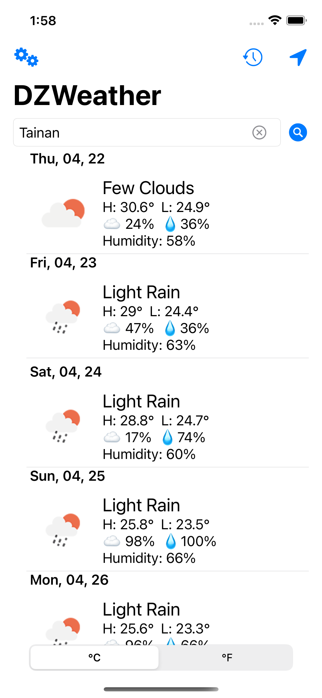

# DZ Weather App
SwiftUI, a weather app follow the courses by [Stewart Lynch](https://twitter.com/StewartLynch), with extra feature added myself like get current location, search history using CoreData.

# Menu
* [Screenshots](#screenshots)
* [Features](#features)
* [To-Do](#to-do)
* [Source](#source)
* [Contributions](#contributions)
* [Contact](#contact)

# Screenshots

# Features

* Get current location
* User default for last search and temperature unit
* Error message customizable
* Dismiss keyboard
* Customized loading view 
* TextField search history using CoreData

### To-Do
* TextField search history using CoreData(done)

# Source
This weather app follow the courses by [Stewart Lynch](https://twitter.com/StewartLynch), fully developed with SwiftUI.

### API 
[OpenWeather](https://openweathermap.org/api)

### Library used
[SDWebImageSwiftUI](https://github.com/SDWebImage/SDWebImageSwiftUI)

# Contributions

* All kinds of contributions (enhancements, new features, documentation & code improvements, issues & bugs reporting & todo task) are welcome. Let's make it better.

# Contact
Created by [Terry Kuo](https://twitter.com/ArgonYoYo) - feel free to contact me!
